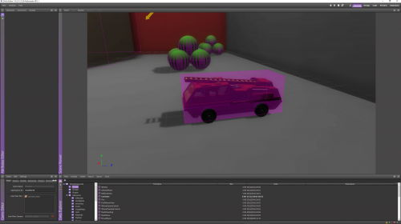
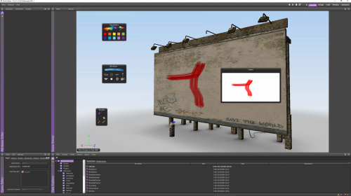
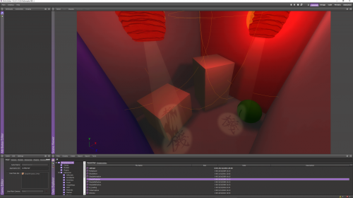

# ShiVa 192 Editor - Classic Samples
This repo contains a collection of classic ShiVa 1.9.2 demos that came pre-installed with the editor. The samples are so simple and easy to understand that they serve as ShiVa introduction and learn-by-example tutorials alike. Samples that were either too big (e.g. TheHUNT) or were incompatible with ShiVa 2.0 without modification (e.g. plugin projects) are not included.

## Packs included
- 3DPaint
- AmbientMusic
- BallDynamics
- CarGame
- Fire
- FirstPersonView
- iPhoneCameraControl
- iPhoneCharacterControl
- MeshMorphing
- MeshWave
- Multiplayer
- MultiViewport
- Navigation
- ObjectShowView
- PonctualSounds
- PostRender
- RopeDynamics
- ScreenShockwave
- ShockWave
- SimpleAnimation
- SimpleProjector
- SimpleReflection
- SimpleRefraction
- st_loading-airplaneOcean
- VideoCapture
- Wiimote

# License
The ShiVa license applies to all of these STE packages (code is free to use, but art assets are not). 

# Screenshots
  
